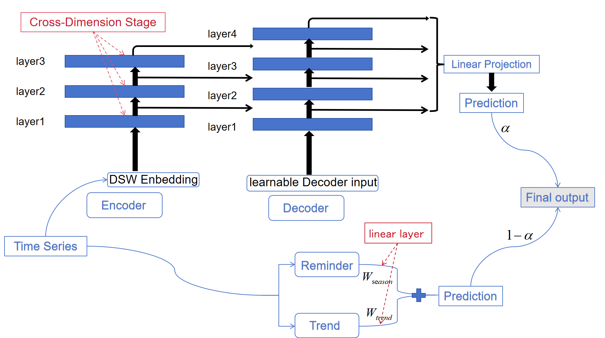

# DecoFormer:Enhancing CrossFormer's Performance through DLinear Integration

**Decoformer** mainly addresses Time Series Forecasting(TSF) problem based on [CrossFormer](https://github.com/Thinklab-SJTU/Crossformer) (ICLR2023). 
Considering that TSF is time-related, 
whereas Crossformer's design of Cross-Time Stage(CTS) applies time-invariant Multi-Attention 
Mechanism, this work removes CTS and integrates another model called Decomposition Linear 
(also noted as *Dlinear*). The resulting hybrid architecture shows stronger forecasting accuracy than Crossformer in long-term prediction with fixed input length on two real-world benchmark. Moreover, a 1.25x speedup is achieved due to the removal of the CTS module while maintaining performance.



After experimenting, hyper-parameters are suggested as follows：


1) For short-term prediction($\tau=24,48,72$), set $seg\_len$ as 6, \textbf{$learning\_rate$} as $10^{-4}$, $e\_layers$ as 3, $dwin\_size$ as 23.
2) For long-term prediction ($\tau=168, 672, 720$), set \textbf{$seg\_len$} as 24, \textbf{$learning\_rate$} as $10^{-5}$, $e\_layers$ as 2, $dwin\_size$ as 105.


## Project Structure

```plain
├── README.md
├── datasets                # datasets used in the project
│   ├── ETTh1.csv
│   └── ETTm1.csv
├── output                  # outputs of Decoformer in experiments
│   ├── ETTh1
│   └── ETTm1
├── paper.pdf        
├── pic                     # visualized pictures
├── scripts
├── src                     # source code of Decoformer
└── visualization
```
